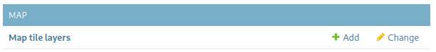

# Base Map - Tile Layers
Search Management Map uses [Leaflet](https://leafletjs.com/) to present the map.
The built-in default is to use [Open Street Maps](https://www.openstreetmap.org/about). You can use any tile server that Leaflet can access.

You can add additional layers by clicking on the "Add" Next to `Map tile layers` on the admin page:

This will give you a form where you can specify details about the tile layer.
* `Name`: is the name this layer will have in the map for users to select it
* `Url`: Is the url, the format is defined in the [Tile Layer help](https://leafletjs.com/reference.html#tilelayer) for Leaflet
* `Base`: Specifies whether this is a base-layer, or any overlay (only 1 base layer can be enabled at a time, but multiple overlays can be)
* `Attribution`: Specifies the attribution that will appear when this tile layer is in use (i.e. copyright and link to data source)
* `MinZoom` and `MaxZoom`: Specifies the minimum and maximum zoom range for this tile layer
* `Subdomains`: If your `Url` includes `{s}`, then you can specify valid subdomains for the url, see more [here](https://leafletjs.com/reference.html#tilelayer-subdomains)
* `Active`: This needs to be ticked for the layer to appear as an option for users.
* `RelativeOrder`: Used to determine the order this layer will appear relative to other base or overlays layers
