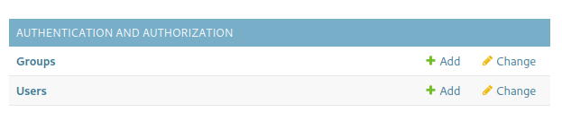
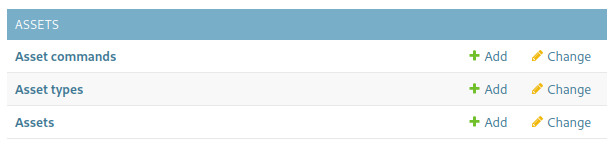

# Administration

Some basic management function of Search Management Map is provided by Django's built-in site administration system.

This is accessible as /admin/ on your server. If you have an instance running on your computer as per the basic [Installation](../Install/) instructions, this would be [http://localhost:8080/admin/](http://localhost:8080/admin/)

## Adding Users
From the main admin page, you can add a user by clicking "Add" next to the Users item:

This will give you a form where you can supply a username and password for the new user.

## Adding Assets
In Search Management Map, `Asset` is used as the general term for things that can perform a search. These could be aircraft, boats, off road vehicles, a search party, or anything else you have available to your organization(s).

### Asset Types
Asset types are a way to group assets that have similar functionality and/or performance. Each search has an associated asset type because generally their parameters will vary based on the asset type that is intended to conduct the search.

There are no built-in asset types in Search Management Map. Each organization will have access to different assets and want to group them based on their preferences and systems. Assets have a single associated asset type. You can always create more asset types and/or change the asset type of an asset later.

You will need to create at least one asset type. You probably want to create one asset type for each group of assets that require different planning parameters. 
Some examples:
* `fixed-wing` and `helicopter`, if you have access to both types.
* `boat` or `vessel`, if you have water assets.
* `land-team`, i.e. for landsar or similar SAR organizations
* `UAV` and/or `RPAS`, i.e. if you have access to any UAVs (depending on your UAV, it may be directly controllable by Search Management Map)
* `team` or `organization`, i.e. if you have multiple internal teams or external organizations you can deploy
* `radio-repeater`, while these generally can't perform a search, they can still be useful to show on the map

Depending on the variety of assets you have access to, you may wish to break categories down further. i.e. if you have both small inflatable ribs and larger offshore vessels, you probably want to make different asset types.

#### Adding a New Asset Type

You can add new `asset types` by clicking on the "Add" next to `Asset Types` on the admin page:

This will give you a form where you can specify the Name and Description of the new Asset Type. The `Name` is how this Asset Type will be presented everywhere (i.e. drop-down boxes, information fields) in Search Management Map.

### Adding a New Asset
You can add a new `asset` by clicking on the "Add" next to `Assets` on the admin page:

This will give you a form where you can specify the Name, Owner and Asset Type of the new Asset. The `Name` needs to be unique and is how this Asset will be presented everywhere in Search Management Map.
The Owner is the user who can act as the asset. This user will be able to record the position, add the asset to organizations, etc.
Normally it is best to have a separate account for each asset, this helps to avoid accidentally mixing up assets.